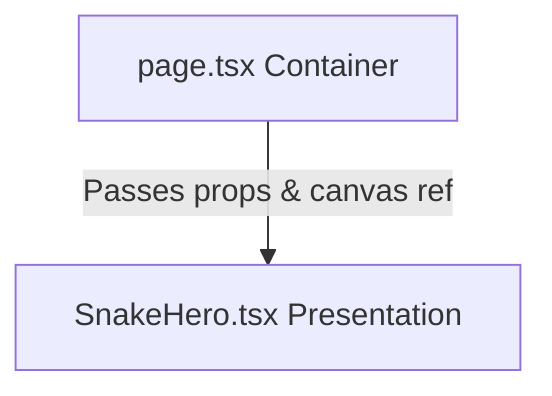

# Project Documentation: Snake Atlas — Scroll-Driven Cinematic Experience

## 1. Project Overview
The **Snake Atlas** is a premium, cinematic, scroll-driven interactive wildlife exhibition. Moving away from traditional landing pages and cluttered grids, it adopts a luxury documentary design language inspired by Apple’s product storytelling, National Geographic’s editorial print layouts, and Awwwards-winning immersive interactions.

### The User Experience
When a visitor enters the website:
- A minimalist cinematic loader preloads and decodes the frame assets, avoiding page layout shifts.
- Once loaded, the page presents a single full-screen exhibit chapter. 
- Scrolling the page does not cause the page text to move off-screen. Instead, vertical scroll actions are mapped directly to a canvas drawing pipeline, rotating the species smoothly in place (a 3D-like parallax effect).
- Spacing, margins, and typography layout are locked to establish a timeless, consistent design system. The interface fades into the background, focusing attention entirely on the featured species.

---

## 2. Tech Stack

| Technology | Purpose | Why It Was Chosen |
|------------|---------|-------------------|
| **Next.js 15 (App Router)** | Framework | Offers server-side rendering support, native route optimization, and Turbopack for extremely fast build compiles and hot reloading. |
| **TypeScript** | Programming Language | Enforces strict static typing, making the codebase self-documenting and preventing runtime errors in animation and canvas math. |
| **Tailwind CSS v4** | CSS Styling | Provides utility-first styling with modern theme extensions. Tailwind v4 compiles faster and utilizes a clean CSS `@theme` block. |
| **Framer Motion** | Animation & Gesture | Industry standard library for handling physics-based spring smoothing, gesture events, and value transforms (`useScroll`, `useSpring`). |
| **Lucide React** | Icon Pack | Minimalist vector icons (`MapPin`, `Ruler`, `Shield`) that fit the clean editorial layout without cluttering the screen. |
| **Google Fonts** | Typography | Loads premium fonts (Playfair Display for headings, Plus Jakarta Sans for UI text) directly from Google's optimized next/font bundle. |
| **HTML5 Canvas** | Image Sequence Rendering | Allows high-performance drawing of high-resolution JPEGs. Avoids DOM node bloat and browser rendering overhead. |
| **npm** | Package Manager | Standard package manager with lockfile constraints to ensure deterministic installations. |
| **ESLint** | Code Linting | Automates styling checks and enforces Next.js app directory rules. |

---

## 3. Project Folder Structure
```
snake-website/
├── public/
│   └── Reticulated-python-1/   # Preloaded 82-frame JPEG sequence
├── src/
│   ├── app/
│   │   ├── globals.css         # Tailwind v4 directives, noise grain, resets
│   │   ├── layout.tsx          # Font loads, HTML wrapper, layout metadata
│   │   └── page.tsx            # Main scroll controller & preloading logic
│   └── components/
│       └── SnakeHero.tsx       # Reusable layout template component
├── tsconfig.json               # TypeScript configuration compiler options
├── next.config.ts              # Next.js configurations
└── postcss.config.mjs          # PostCSS tailwind processing config
```

### Responsibility of Important Folders
- **`public/Reticulated-python-1/`**: Contains the 82 JPEGs (`ezgif-frame-001.jpg` to `ezgif-frame-082.jpg`) representing the isolated 3D rotation sequence.
- **`src/app/`**: Implements the App Router hierarchy. `layout.tsx` handles document structure, metadata, and font injections. `page.tsx` serves as the container page that tracks scrolling gestures.
- **`src/components/`**: House presentation-only layout components. By separating the container logic (`page.tsx`) from the visual layout (`SnakeHero.tsx`), we maintain a clean separation of concerns.

---

## 4. Component Architecture
The application employs a clean container-component architecture:



### Reusability & Props
The `SnakeHero` component is designed as a template. It receives all textual descriptions, metadata lists, header actions, and the canvas ref via its typed props interface:

```typescript
export interface MetadataItem {
  label: string;
  value: string;
  icon?: React.ReactNode;
}

export interface SnakeHeroProps {
  logoText?: string;
  eyebrow: string;
  eyebrowIcon?: React.ReactNode;
  title: string;
  description: string;
  metadata: MetadataItem[];
  ctaText?: string;
  backgroundColor?: string;
  textColor?: string;
  borderColor?: string;
  canvasRef: React.RefObject<HTMLCanvasElement | null>;
}
```

---

## 5. Design System
The design system of the Snake Atlas is defined by **strict constraints** to preserve a premium visual balance:
- **Locked Grid**: Spacing, margins, padding, and font sizes are defined with absolute responsive utilities. New pages only inject new copy and assets.
- **Left Column Focus**: The text details are confined to a clean column (`w-full md:w-[50%] lg:w-[45%]`) with generous left margin offsets to keep the layout structured.
- **Right Side Negative Space**: The snake sequence renders on the right half, ensuring typography never overlaps the head. A large visual void is preserved in the center to create breathing room.

---

## 6. Typography System
We use two primary typefaces loaded dynamically via Next.js:

- **Playfair Display (Serif)**: Loaded as `--font-serif-display` and configured in Tailwind. This display font is used exclusively for the title headings, utilizing a light font-weight, close line-height (`leading-[0.95]`), and uppercase styling to emulate high-end print magazines.
- **Plus Jakarta Sans (Sans-Serif)**: Loaded as `--font-sans-display` and set as the default sans-serif font. It is used for all UI indicators (logo, buttons, metadata titles, description text) to provide a modern, highly legible contrast.

---

## 7. Color System
The color palette relies on high-contrast, editorial tones:
- **Background Color**: Passed dynamically as a prop. For the Reticulated Python, it uses `#ebb11c` (a rich honey-gold).
- **Text Color**: Adaptive styling (e.g. `text-neutral-950` on gold backgrounds, or `text-white` on dark themes) ensures perfect readability.
- **Border and Separator Colors**: Subtle, low-opacity borders (`border-neutral-900/30`) provide light structure without overpowering the typography.

---

## 8. Spacing System
- **Navigation Padding**: `py-8 px-6 md:px-12` (expands to fill the screen width).
- **Details Column Margins**: A standard margin is established using `px-6 md:px-12` matching the header bounds.
- **Description Margin**: Spaced at `mb-10` to push the metadata row down.
- **Metadata Margin**: Spaced at `mb-10` to position the CTA link elegantly at the bottom.

---

## 9. Navigation System
The header is **not sticky** to respect classic editorial print layouts—it appears at the top of the chapter view and disappears as the user interacts with the canvas.
- **Left Section**: Minimalist snake head SVG logo and tracked `SNAKE ATLAS` text.
- **Right Section**: A rounded outline pill button labeled `Explore →` which serves as the entry CTA.
- **Width**: The navigation container is set to `w-full px-6 md:px-12` (no max-width limits), ensuring the header elements sit cleanly towards the left and right edges.

---

## 10. Button System
- **Rounded Outline Button (`Explore →`)**: A pill-shaped border-current button that uses a clean outline. Hover transitions scale the button (`hover:scale-105`) and fill the background.
- **Editorial CTA Link (`Discover this species →`)**: A clean link with a thin bottom border (`border-b border-current`) and an arrow icon. Hover actions transition the bottom border to transparent and slide the arrow icon to the right (`group-hover:translate-x-1`), rewarding cursor interaction.

---

## 11. Animation System
Animations are designed to feel like a high-end wildlife exhibition:
- **Entrance Animation**: Page loads with a subtle preloader fade-out.
- **Spring-smoothed Scroll**: We map scrolling progress to frame drawing using a mass-optimized spring (`damping: 32`, `stiffness: 180`, `mass: 0.12`). This filters out jittery trackpad or mouse wheel steps.
- **Layout Animations**: Text items are loaded inside standard divs, utilizing CSS transitions for HMR and keeping component mounts stable.

---

## 12. Scroll System
The scroll system works via a virtual scroll track:
- **Scroll Container**: A container of `350vh` height is created on the page.
- **Sticky Viewport**: Inside the container, a `sticky-viewport` class with `position: fixed` locks the layout inside the screen.
- **Frame Index Mapping**:
  ```typescript
  const { scrollYProgress } = useScroll({ target: containerRef });
  // Map 0-1 progress to 0-81 frame sequence indices
  const frameIndex = Math.max(0, Math.min(TOTAL_FRAMES - 1, Math.floor(latest * TOTAL_FRAMES)));
  ```
- **requestAnimationFrame**: Redraw calculations are queued in the browser's painting cycle to prevent render blocks.

---

## 13. Canvas Rendering
Drawing 82 high-resolution images in rapid succession using raw DOM `` elements causes extreme layout thrashing. The canvas rendering pipeline resolves this:
- **Why Canvas is Used**: Canvas offers a single GPU-accelerated drawing surface.
- **Drawing Pipeline**:
  ```typescript
  ctx.clearRect(0, 0, canvasWidth, canvasHeight);
  ctx.imageSmoothingEnabled = true;
  ctx.imageSmoothingQuality = "high";
  ctx.drawImage(img, drawX, drawY, drawWidth, drawHeight);
  ```
- **Right Alignment**: When rendering on desktop screens, if the scaled image is wider than the viewport, `drawX` is offset to align the image right (`drawX = canvasWidth - drawWidth`), pushing the snake head to the right side of the screen.

---

## 14. Performance Optimizations
- **Image Preloading & Decoding**: Images are instantiated and cached in `imagesRef.current`. We call `img.decode()` before hiding the loader, forcing the browser to decode and cache the JPEG textures in GPU memory.
- **State De-coupling**: Scroll updates do NOT write to React states (`useState`). By writing progress values directly to `lastRenderedIndexRef` and reading them on scroll events, we avoid React re-rendering the entire layout tree on every single scroll tick.
- **Debounced Paint Frames**: Multiple wheel inputs in a single frame cycle are throttled using `requestAnimationFrame`.

---

## 15. Libraries Used

| Library | Purpose | Why Used |
|---------|---------|-----------|
| **`framer-motion`** | Scroll and Spring tracking | Delivers mathematical spring curves and scroll event dispatchers in a lightweight React wrapper. |
| **`lucide-react`** | Icon graphics | Renders clean SVG outlines for map pins, shields, and rulers. |
| **`tailwindcss`** | Style utilities | Enables swift design configurations, and builds clean Tailwind v4 utility values. |

---

## 16. Assets
- **Frame Sequence**: 82 isolated JPEGs stored inside `/public/Reticulated-python-1/`. The files are named sequentially (`ezgif-frame-001.jpg` to `ezgif-frame-082.jpg`).
- **Icons**: Clean inline SVGs are preferred for the logo and venom properties to keep control over vector styles, and Lucide React is used for details.

---

## 17. Responsive Design
- **Desktop (>= 1024px)**: Full column presentation with a 50% split. Canvas occupies 100% height, anchored right.
- **Tablet (>= 640px)**: The text details card spans 60% of the screen. Logo and Explore button shift inwards slightly via container paddings.
- **Mobile (< 640px)**: Scale font sizes down (`text-[48px]` for heading). The canvas remains absolute in the background, drawing the snake sequence behind the white typography.

---

## 18. Design Patterns
- **Container-Presenter Pattern**: `page.tsx` handles business logic (scroll tracking, image loading) while `SnakeHero.tsx` renders the layout.
- **Props Pattern**: All species details are passed down dynamically, separating code from content.
- **Refs Pattern**: Canvas elements and preloaded arrays are references, avoiding state updates.

---

## 19. Code Quality
- **Self-Documenting Types**: Complete TypeScript typing for props and metadata.
- **Readability**: Logic blocks are separated with descriptive comments.
- **Scalability**: Config configurations (metadata icons, labels, descriptions) are defined in arrays, keeping HTML clean.

---

## 20. Future Scalability
The project is architected for easy expansion. To add new snake species (e.g. Green Tree Python):
1. Place the new frame sequence in `/public/Green-tree-python/`.
2. Define a new metadata config object in `page.tsx`.
3. Render the `<SnakeHero />` component with the new background color and prop values.
The design system guarantees the margins and typography remain aligned.

---

## 21. Engineering Decisions
- **Next.js vs. Single-Page SPA**: Next.js was selected to provide optimized asset prefetching, image loading, and compile-time metadata rendering.
- **Canvas vs. SVG/CSS**: Canvas was selected over standard DOM images to enable 60 FPS drawing transitions and avoid layout thrashing during scrolls.

---

## 22. Design Decisions
- **Classic Editorial Serif (Playfair Display)**: Chosen to emulate physical catalogs and National Geographic layouts.
- **Pill Outline Buttons**: Chosen to align with Apple-style product visual minimalism.
- **Generous Spacing**: Chosen to convey luxury, premium quality, and museum atmosphere.

---

## 23. Project Summary
The **Snake Atlas** successfully merges premium editorial aesthetics with clean, high-performance scroll engineering. By using canvas frame painting, spring physics smoothing, and next/font optimizations, it delivers an immersive wildlife exhibition where layout consistency and user interactions are polished to production-level standards.
